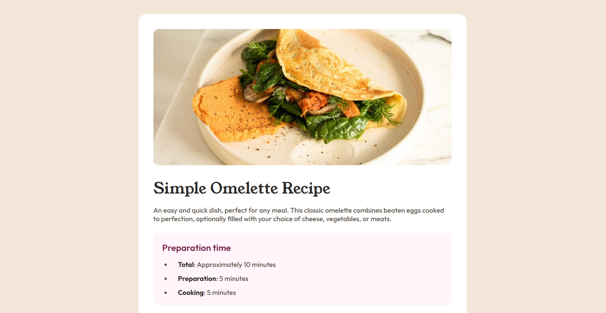

# Frontend Mentor - Recipe page solution

This is a solution to the [Recipe page challenge on Frontend Mentor](https://www.frontendmentor.io/challenges/recipe-page-KiTsR8QQKm). Frontend Mentor challenges help you improve your coding skills by building realistic projects. 

## Table of contents

- [Overview](#overview)
  - [Screenshot](#screenshot)
  - [Links](#links)
  - [Built with](#built-with)
  - [What I learned](#what-i-learned)
- [Author](#author)

**Note: Delete this note and update the table of contents based on what sections you keep.**

## Overview
This is a simple Recipe page project that includes:
- an Image and Title of the recipe
- list of the ingredients required for the recipe 
- Step-by-step cooking instructions
### Screenshot

### Links

- Solution URL: [Recipe page Solution](https://github.com/shubhamqx/recipe-page-frontend-mentor)
- Live Site URL: [Recipe page Live](https://your-live-site-url.com)

### Built with

- Semantic HTML5 markup
- CSS custom properties
- Flexbox
- Mobile-first workflow

### What I learned

I learned about Mobile first Approach while making this project

## Author

- Frontend Mentor - [@shubhamqx](https://www.frontendmentor.io/profile/shubhamqx)

